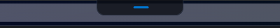
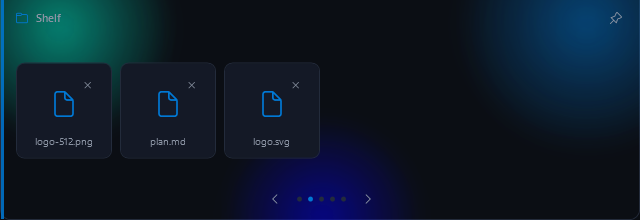
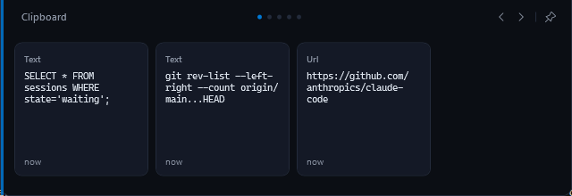
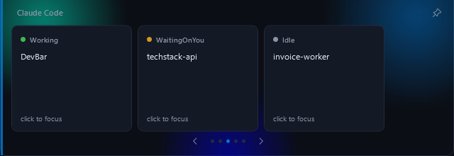
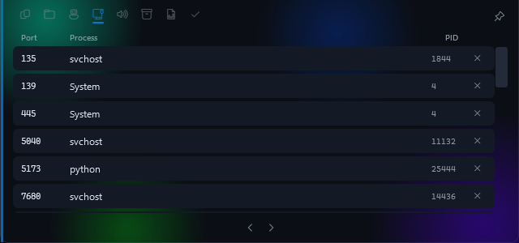
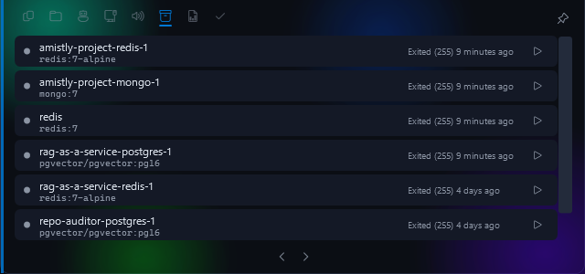
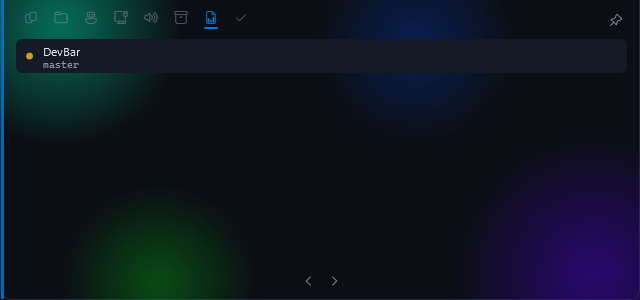
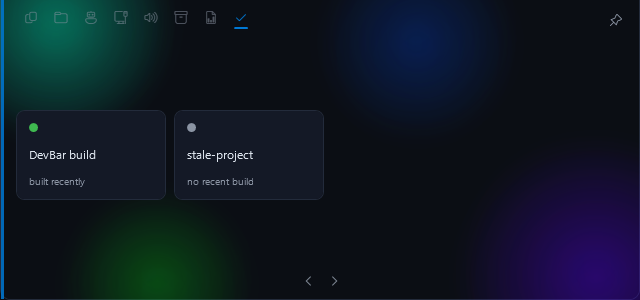

<div align="center">
  
  <h1>DevBar</h1>
  <p><strong>A small, hover‑expand command strip for Windows developers.</strong><br>
  Nearly invisible until you need it. Not another window to manage - a strip that shows up, does one thing, and gets out of the way.</p>
</div>

---

Windows has a taskbar for your apps, notification icons for background noise, and nothing for the handful of things you actually check fifty times a day: *is my Claude Code session done, what's in my clipboard, is anything listening on 5173, did I mean to copy that.*

DevBar is that. It's a tiny pill docked to the top of your screen - about the size of a browser tab - that expands into a small card when you hover over it, and disappears the instant you don't need it.

```
      ▁▁▁▁▁▁▁▁▁▁▁▁▁          ← idle, all day
   ┌─────────────────────┐
   │ 🗐 🗀 🤖 🌐 🐳 …    📌│  ← hover, drops down like a shade; tap a tab or swipe
   │  [chip] [chip] [chip]│
   │        ‹    ›         │
   └─────────────────────┘
```

## Why this and not [taskbar utility / Rainmeter / PowerToys]

- **It's small.** DevBar is not a second taskbar. It's ~125px idle, ~640px expanded, centered near the top edge. It never reserves screen real estate, never pushes your windows around, and every pixel outside the pill is click‑through - whatever's under it still works normally.
- **Hover, not click.** Glance up, it's there. Look away, it's gone. No window to alt‑tab past, no icon to remember. The expand motion is a drop‑down reveal - like a shade unrolling from the pill, not a card growing out of nowhere.
- **Liquid glass, not a flat panel.** The expanded card sits on genuine Windows compositor blur (Acrylic) plus a mesh of soft, slowly-drifting accent-colored blobs (each blurred at radius 24) behind the content - the shifting, organic tint of modern glass UI, built from your own live accent color rather than a static gradient. Respects Windows' **Reduce Transparency** setting - off means a flat opaque panel, no blur, no mesh, automatically.
- **Modular.** Each capability is a self‑contained module behind a five‑method interface. The bar ships with eight; writing your own takes an afternoon.
- **Genuinely lightweight.** Every module is event‑driven or polls only while its card is on screen - nothing runs while the bar is collapsed, **including the blur**, which is switched off at the OS level the instant the bar collapses specifically because live blur is not free (see [Performance](#performance)). Measured on this machine: **0.0% CPU at idle**, ~90–140MB working set. Measured, not asserted.

## Modules

Tap a module's tab directly, or page through with the arrows / a touchpad swipe - see [Using it](#using-it).

| Module | What it shows |
|---|---|
| 🗐 **Clipboard** | Last 25 copies, type‑tagged (text/URL/code), click a chip to re‑copy it, × to delete one |
| 🗀 **Shelf** | Ephemeral drag‑and‑drop scratch space for files - clears on restart, on purpose |
| 🤖 **Claude Code** | Active CLI sessions (working / waiting on you / idle), click to focus the terminal |
| 🌐 **Ports** | Listening TCP ports with owning process, one click to kill |
| 🐳 **Docker** | Running/stopped containers via `docker ps`, one click to start/stop, clear "not installed" vs "not running" states |
| 🌿 **Git Status** | Dirty/clean + ahead/behind for a config‑listed set of repos, click a row to open its folder |
| ✅ **Build Pulse** | A quiet status light per watched build output - did something build recently, yes or no |
| 🔊 **Now Playing** | Whatever's playing system‑wide (Spotify, a browser tab, anything), with transport controls |

Docker, Git Status, and Build Pulse are all opt‑in - see [Config](#config) below for the two-line `config.json` additions each one needs.

### Screenshots

All captured from the app actually running - nothing mocked up.

**Idle** - this is what's on your screen all day:



**Shelf** - a real drop-target treatment when empty; drag files in and they show up as chips:



**Clipboard** - every copy shows up live, type‑tagged, click to re‑copy, × to delete:



**Claude Code** - session state per project, at a glance:



**Ports** - real listening ports on this machine, labeled columns, one click to kill:



**Docker** - real containers on this machine, start/stop per row:



**Git Status** - dirty/clean and branch at a glance:



**Build Pulse** - a status light per watched target, nothing more:



## Install

**Requirements:** Windows 10 2004+ or Windows 11 (x64).

### Option A - installer (recommended)

Download `DevBar-Setup-<version>.exe` from [Releases](https://github.com/Vivek-C-Shah/DevBar/releases) and run it.

- **No admin required** - installs to your own user profile (`%LOCALAPPDATA%\Programs\DevBar`), so it's a plain double‑click, no UAC prompt.
- **No separate .NET install needed** - this build is self‑contained (the runtime is bundled into the exe), unlike Option B below.
- Adds a **Start Menu entry** - press the Windows key, type `devbar`, hit Enter, exactly like any other installed app.
- Optional checkbox to launch DevBar automatically at sign‑in.
- Comes with a clean uninstaller (Settings → Apps, or the Start Menu entry).

To build the installer yourself instead of trusting a downloaded binary, one command does the whole thing (publish + compile):

```powershell
git clone https://github.com/Vivek-C-Shah/DevBar.git
cd DevBar
.\scripts\build-installer.ps1
```

It needs the **.NET 8 SDK** and **Inno Setup** - if either is missing, the script tells you exactly what to install:

```powershell
winget install Microsoft.DotNet.SDK.8
winget install JRSoftware.InnoSetup
```

> **`dotnet` not recognized right after installing the SDK?** winget adds it to your PATH, but a terminal window opened *before* the install won't pick that up - close it and open a new one. (`build-installer.ps1` also falls back to the default install path automatically, so this usually isn't even necessary.)

Produces `dist\DevBar-Setup-<version>.exe` - the same installer described above.

### Option B - build and run from source (for development)

```powershell
git clone https://github.com/Vivek-C-Shah/DevBar.git
cd DevBar
dotnet build DevBar.sln -c Release
.\src\DevBar\bin\Release\net8.0-windows10.0.19041.0\DevBar.exe
```

This framework-dependent build needs the [.NET 8 Desktop Runtime](https://dotnet.microsoft.com/download/dotnet/8.0) installed separately - Windows will prompt for it if missing. Faster to iterate on than the self-contained publish (no packaging step), but not what you'd hand to someone else to install - that's Option A.

### Debug / demo flags

Useful if you're developing a module and want to skip the hover dance:

```powershell
DevBar.exe --demo clipboard          # launch pinned open on a specific module
DevBar.exe --shelf-seed "C:\a.png;C:\b.txt"   # pre-populate the Shelf
```

## Using it

- **Hover** the pill to expand it. **Move away** and it collapses after a short delay.
- **Tap a tab** in the strip at the top to jump straight to that module, or **page** with the arrows at the bottom‑center of the card, or a **two‑finger horizontal swipe** on a precision touchpad. All three do the same thing - use whichever's closest to your hand.
- **Pin** (top‑right) holds the bar open for a session - useful while babysitting a build.
- **Drag a file** over the idle pill and it reveals itself so you can drop onto the Shelf.
- **Right‑click the tray icon** for pin/config/exit.

### Config

Lives at `%LOCALAPPDATA%\DevBar\config.json` - hand‑editable, reloaded on next launch. Module order, disabled modules, and clipboard history size are all there with sane defaults; three fields are opt‑in and empty until you fill them in:

```json
{
  "gitWatchedRepos": ["D:\\code\\my-app", "D:\\code\\another-repo"],
  "ciWatchTargets": [
    { "name": "my-app build", "path": "D:\\code\\my-app\\bin\\Release" }
  ],
  "disabledModules": ["media"]
}
```

`ciWatchTargets.path` can point at a file or a directory - for a directory, Build Pulse watches whichever file inside it was modified most recently.

### Claude Code integration

The Claude Code module has two detection tiers. If you want reliable state (not just "a terminal titled claude exists"), have your session write a tiny status file:

```
%LOCALAPPDATA%\DevBar\claude-sessions\<anything>.json
```

```json
{ "project": "my-app", "pid": 1234, "state": "waiting" }
```

`state` is one of `working` / `waiting` / `idle`. No file present → DevBar falls back to scanning for terminal windows with "claude" in the title, best‑effort.

## Performance

This was the actual design constraint, not a footnote - the plan going in was explicit: *don't build a tool that costs more attention than it saves.* So the numbers below are measured on this dev machine, not asserted:

| | Idle (collapsed) | Expanded (Acrylic blur + mesh gradient active) |
|---|---|---|
| CPU | **0.0%** over a 5–10s sample (`Get-Process` `TotalProcessorTime` delta) | **~45–50%** of one core, sustained |
| Working set | ~90–140MB | same ballpark |
| Threads | ~30 | ~30 |

That expanded-state number is not a typo, and it's the one honest tension in this whole design: real Windows Acrylic blur-behind is genuinely expensive - DWM has to keep re-sampling whatever's behind the window for as long as it's on, and four independently-drifting blurred mesh blobs add more compositor work on top of that. This is why **the entire discipline of this app is making sure that cost only exists for the few seconds a developer is actually looking at the expanded card** - `GlassEffect.Enable`/`Disable` and `StartBlobDrift`/`StopBlobDrift` are called from `Expand()`/`Collapse()` specifically so it drops back to 0.0% the instant the bar collapses, never during the ~99% of the day it sits idle as a small pill. If you'd rather not make that trade at all, Windows' own "Transparency effects" setting turns it off entirely - see [Accessibility](#on-liquid-glass) below.

How the *idle* number stays at zero:
- **Nothing polls while collapsed.** Every module's timer starts in `OnExpanded()` and stops in `OnCollapsed()` - verified by design, not just by convention (see `IDevBarModule`).
- **Clipboard and hover are 100% event‑driven** - `AddClipboardFormatListener` and native mouse‑enter/leave, no polling loop anywhere in the shell.
- **Every system-scanning module runs off the UI thread** (`Task.Run`) - Ports, Claude Code, Docker, and Git status all shell out or enumerate processes in the background, so a slow scan on a loaded dev box never stalls the animation.
- **No AppBar space reservation.** Early builds used the Win32 AppBar API (same mechanism as the taskbar) to reserve the full screen width - it worked, but it's the wrong shape for a tool this small, and it meant every app on the machine had to respect a strip it didn't need to. Current build is a plain topmost window sized to its own content, with `WM_NCHITTEST` making the space around the pill click‑through.

### On "Liquid Glass"

Worth being precise about what this actually is, since the ask was for a specific, named design language (Apple's Liquid Glass) and Windows doesn't expose the same primitives macOS/iOS do:

- **Real backdrop blur, yes** - via `SetWindowCompositionAttribute` (Acrylic), genuinely blurring whatever's behind the window at the OS/compositor level.
- **"Blur radius 24," applied literally** - but to the bar's own mesh-gradient blobs (`BlurEffect Radius="24"` in WPF, which *does* expose a real pixel radius), not to the backdrop blur itself. Windows' Acrylic API doesn't take a radius parameter; its blur amount is fixed by the OS.
- **"Organic tint that shifts"** - four soft, slowly-drifting radial-gradient blobs, asymmetrically placed and each on its own drift speed/direction so they never sync up, in hues rotated off your live Windows accent color, not a static gradient. What it is *not*: literal live-sampling of desktop pixel colors behind the window to drive the tint. That would mean continuous screen-capture + color analysis, which is real, ongoing CPU cost of exactly the kind this app spent most of its effort eliminating - not a trade worth making for a decorative effect.
- **Accessibility fallback, real** - `AccessibilityHelper.PrefersReducedTransparency()` reads Windows' actual "Transparency effects" setting (Settings → Accessibility → Visual effects) via `UISettings.AdvancedEffectsEnabled` and swaps in a fully opaque panel, no blur, no mesh, when it's off.
- The working‑set floor (~90MB) is WPF + CLR baseline plus the Windows Runtime projections the accent‑color and Media modules touch once at startup - the honest cost of native UI on .NET, not something the bar wastes ongoing.

Electron would have made the first screen faster to build and the process afterward heavier by 100+MB and non‑zero at idle - that trade is why this is WPF.

## Architecture

```
DevBar.Sdk          IDevBarModule contract - five methods, that's the whole surface
DevBar (app)
  Core/              AppBar-free window shell, native interop, config, clipboard hook
  Modules/*/         one folder per built-in module (Clipboard, Shelf, Claude, Ports,
                     Docker, GitStatus, CiPulse, Media)
  Themes/            design tokens (colors, type, radii) - see .tastemaker/style-lock.md
```

A module is a class implementing:

```csharp
public interface IDevBarModule
{
    string Id { get; }
    string DisplayName { get; }
    string IconGlyph { get; }
    UserControl BuildCard();   // your widget, built once and cached
    void OnExpanded();         // start timers here
    void OnCollapsed();        // stop them here - this is the whole performance contract
}
```

Drop a compiled DLL implementing it into `%LOCALAPPDATA%\DevBar\modules\` and DevBar picks it up on next launch - no core recompile needed. A proper module template repo is a `v1.2` item; for now, any of the eight built‑in modules under `src/DevBar/Modules/` is the reference implementation to copy from - `Ports/` if your module shells out or scans local state, `Shelf/` if it's mostly drag‑and‑drop UI.

## Roadmap

- [x] **v1** - shell, hover‑expand, five modules, tray icon, no‑admin installer
- [x] **v1.1** - Liquid Glass (Acrylic + mesh gradient), clickable tab‑strip nav, fixed card height across modules, Ports column headers, Shelf drop‑zone empty state, three new modules (Docker, Git Status, Build Pulse)
- [ ] **v1.2** - winget package, per‑monitor support, module template repo + "build your first module" guide
- [ ] **v2** - Slack, PR‑radar modules (OAuth‑backed, once the plugin path is proven), a real CI/GitHub Actions integration for Build Pulse (Running/Failed states, not just Idle/Success)

## Contributing

Issues and PRs welcome. If you're building a module, the contract in `DevBar.Sdk` is intentionally the entire commitment - no base classes to inherit, no lifecycle beyond expand/collapse. Keep new modules to that same standard: **nothing runs while collapsed.**

## License

MIT - see [LICENSE](LICENSE).

## A note on how this was built

DevBar was built end-to-end by Claude (Anthropic), working from a design brief, with a human in the loop for direction and course-correction along the way - including catching a full-width-bar version that didn't match the "small toolbar" intent (leading to a real shell redesign) and later asking for real glass/Acrylic vibrancy, which surfaced a genuine tension worth knowing about if you touch this code: live compositor blur is not free, and it's disabled at the OS level the instant the bar collapses specifically to keep idle CPU at zero. See `GlassEffect.cs` for the details.
